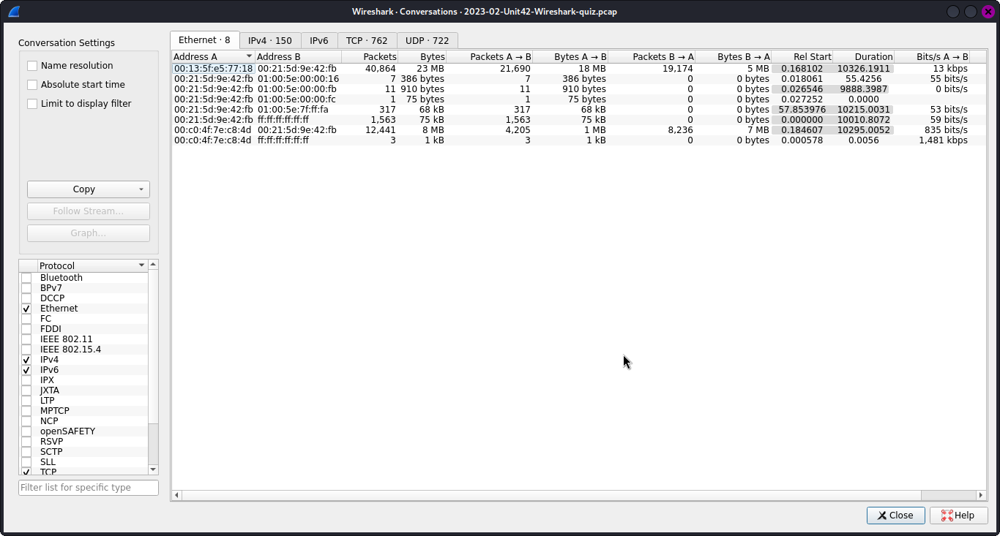
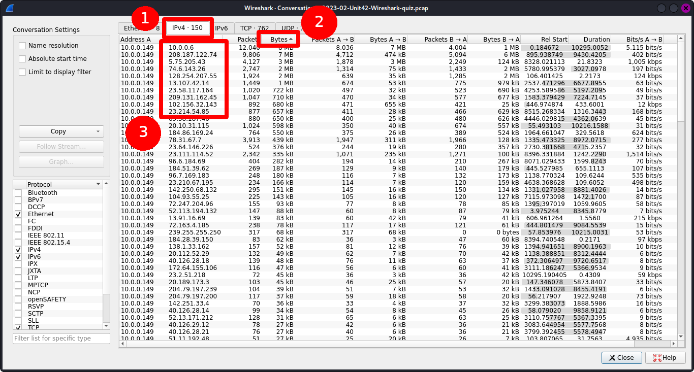
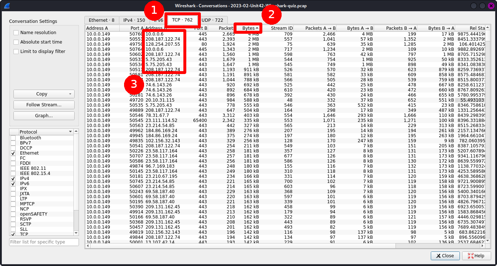

# Threat Hunting  

This project consists of a report generated from a pcap which contained malicious traffic. It is also a skill showcase
for the activity of **network analysis** and **threat hunting**.  

This project is also the owner of this repository's resolution of the [Unit 42 Wireshark Quiz, February 2023][link1]
provided by [PaloAlto's Unit42][link2] team and by Mr. [@brad-duncan][link3], who receives all the credits for the pcap,
the activity's prompt, the basic information about the system, and the requirements for the activity's resolution. The
owner of the repository receives credit for the writing of this report and the analysis made of the pcap described in
this document.  

---

## Index  

1. [Report's summary][link4]  

2. [Pcap's analysis][link5]

3. [Conclusion][link6]

---

## Report's summary  

The [Unit 42 Wireshark Quiz, February 2023][link1] provided some basic information about the system and some
requirements for the resolution of the activity.  

### Information about the system  

The information about the system are the following:  

- The packet capture was done within an AD (*Active Directory*) environment;  
- LAN segment which the malicious activity occurred was: **10.0.0.0/24 (10.0.0.0 through 10.0.0.255)**;  
- Domain involved in the incident: **work4us.org**;  
- The domain controller IP's address: **10.0.0.6**;  
- The domain controller host's name: **WORK4US-DC**;  
- LAN segment gateway which the malicious activity occurred was: **10.0.0.1**;  
- The land segment broadcast address: **10.0.0.255**;  

### Requirements for the solution (Questions)  

The requirements for the solution are the following:  

- The **IP address** of the infected client machine;  
- The **MAC address** of the infected client machine;  
- The **host name** for the infected client machine;  
- The **Windows user account name** of the infected client machine;  
- The **SHA256** hash from the malicious file retrieved from the pcap;  

Additionally:

- The IP(s) and Port(s) associated with the infection;  
- Possible ways through which the infection started;  
- What kind of virus/malware behaves similarly to the one portrayed on the pcap;  
- What is the method of infection;

### Answers  

The answers to the previous questions are:  

- The **IP address** for the infected client: **10.0.0.149**;  
- The **MAC address** for the infected client: Address: **00:21:5d:9e:42:fb**;  
- The **host name** of the infected client: **DESKTOP-E7FHJS4**;  
- The **Windows user account name**: **damon.bauer**;  
- **SHA256** hash of the file: **713207d9d9875ec88d2f3a53377bf8c2d620147a4199eb183c13a7e957056432**;  
- **IP(s)** and **Port(s)** associated with the infection:  

    - 128.254.207.55: 80 (HTTP) (Initial infection);
    - 102.156.32.143: 443 (HTTPS);  
    - 208.187.122.74: 443 (HTTPS);  
    - 5.75.205.43: 443 (HTTPS);  
    - 78.31.67.7: 443 (HTTPS);
    - 23.111.114.52: 65400;  
    - Many connection attempts to several email servers: 25 (SMTP);  

- Pathway which the infection started (**threat vector**): **Possible social engineering attack via malicious email**;  
- Kind of virus/malware: A variation of the **Qakbot** or a **VNC-based** kind of malware;  
- Method of infection: **Malicious DLL infection**;  

---

## Pcap's analysis  

This section will present an in-depth description of the analysis done on the pcap file. The analysis was done using the
[Wireshark][link8] software, version 4.2.2. The same software is going to be used through this dissection.  

As previously mentioned, the pcap file used for this project was taken from the
[Unit 42 Wireshark Quiz, February 2023][link1] activity, and it's referenced [here][link7], where it can be downloaded
and extracted using the password "infected".  

The first thing that was looked in the pcap, it was the "Conversations" tab on Wireshark. To access this tab follow the
instruction:  

> Open the [pcap][link7] on Wireshark > Statistics > Conversations

This tab will open the following window:  

  

Within the "Conversations" tab, the first thing to be looked at will be the "IPV4" transmission.  

  

1. Selecting the IPV4 transmissions;  
2. Sorting the transmission by the size of bytes in each connection, from higher to lower;  
3. Taking notes of the IP addresses with high rate of bytes for further analysis.  

A similar look-up will also be done but now within the "TCP" connections.  

  

1. Selecting the TCP transmission;  
2. Sorting the connection by the byte size, from higher to lower;  
3. Making notes of the IP addresses with high rate of bytes transmission for further analysis.  

Some of the IP addresses contained in the "TCP" section match the ones in the "IPV4" section. A high rate of byte
transmission can be considered an **IoC** (*Indicators of Compromise*).  

This first step of looking through the "Conversations" section of the pcap makes it easier to understand the full scope
of the traffic contained in this file. Even if not all those connections are suspicious in nature, it is a good idea to
go through this section and take notes of those addresses to have them in mind for later analyses and comparisons.  

The next step is to check the network transmissions contained in the traffic.  

Most forms of malware have to use some sort of network connection to the target to be delivered via payload (infected
file or application), receive directives from the threat actor when it's already installed on the target's system, using
**C2** (*Command and Control*), and, in some cases, exfiltrate stolen data to a remote server or back to the attacker.  

The look-up will be done using a filter for the most common network protocols.  

---

## Conclusion  

Here will come the conclusion and notes. 

---

[link1]: https://unit42.paloaltonetworks.com/feb-wireshark-quiz/
[link2]: https://unit42.paloaltonetworks.com
[link3]: https://github.com/brad-duncan
[link4]: https://github.com/ItaloHugoMDS/Threat_Hunting?tab=readme-ov-file#reports-summary
[link5]: https://github.com/ItaloHugoMDS/Threat_Hunting?tab=readme-ov-file#pcaps-analysis
[link6]: https://github.com/ItaloHugoMDS/Threat_Hunting?tab=readme-ov-file#conclusion
[link7]: https://github.com/pan-unit42/Wireshark-quizzes/blob/main/2023-02-Unit42-Wireshark-quiz.pcap.zip
[link8]: https://www.wireshark.org/download.html
