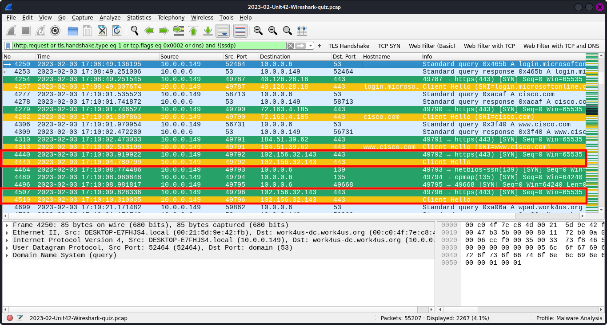
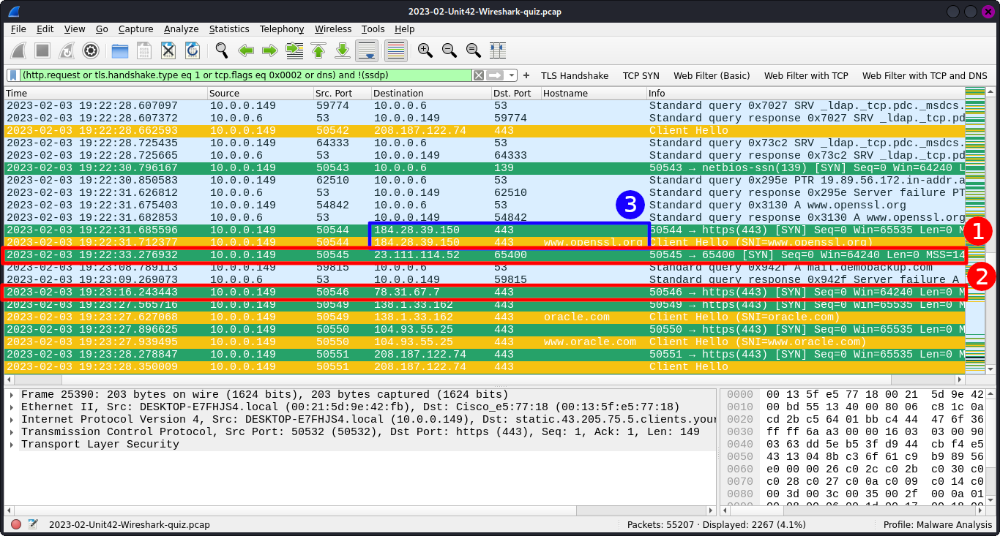
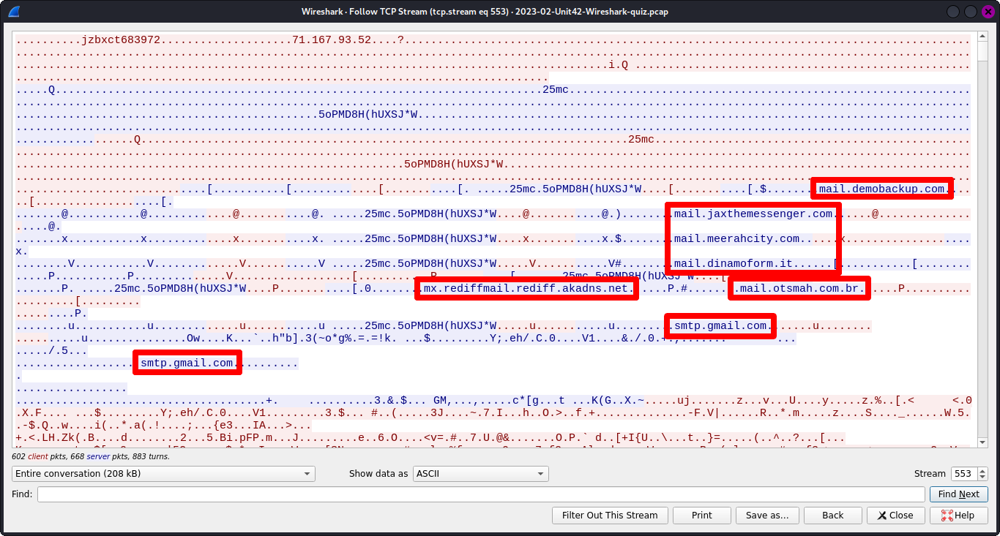
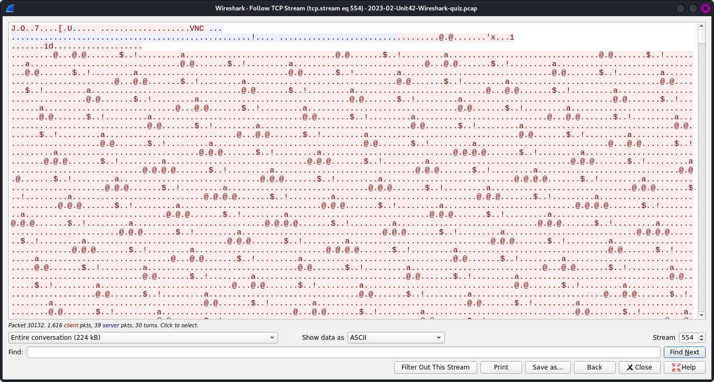
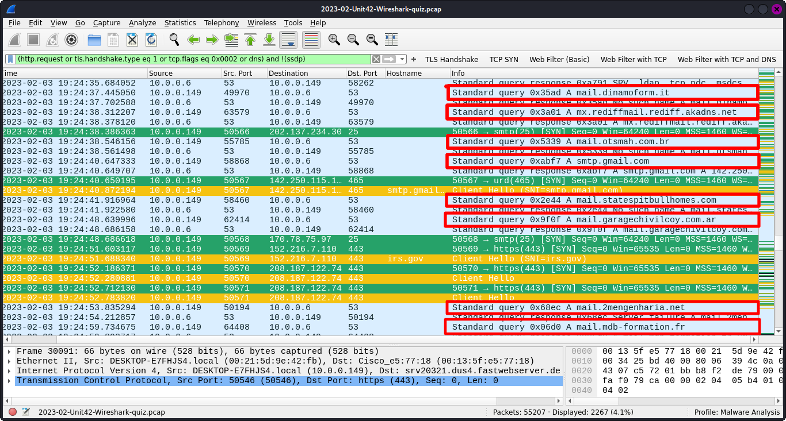
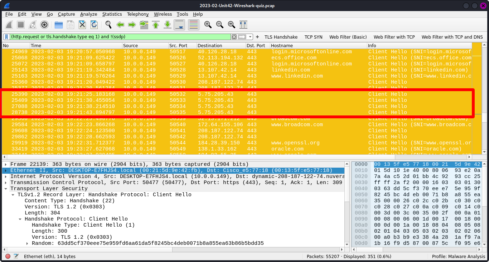

# Threat Hunting  

This project consists of a report generated from a pcap which contained malicious traffic. It is also a skill showcase
for the activity of **network analysis** and **threat hunting**.  

This project is also the owner of this repository's resolution of the [Unit 42 Wireshark Quiz, February 2023][link1]
provided by [PaloAlto's Unit42][link2] team and by Mr. [@brad-duncan][link3], who receives all the credits for the pcap,
the activity's prompt, the basic information about the system, and the requirements for the activity's resolution. The
owner of the repository receives credit for the writing of this report and the analysis made of the pcap described in
this document.  

---

## Index  

1. [Report's summary][link4]  

2. [Pcap's analysis][link5]

3. [Conclusion][link6]

---

## Report's summary  

The [Unit 42 Wireshark Quiz, February 2023][link1] provided some basic information about the system and some
requirements for the resolution of the activity.  

### Information about the system  

The information about the system are the following:  

- The packet capture was done within an AD (*Active Directory*) environment;  
- LAN segment which the malicious activity occurred was: **10.0.0.0/24 (10.0.0.0 through 10.0.0.255)**;  
- Domain involved in the incident: **work4us.org**;  
- The domain controller IP's address: **10.0.0.6**;  
- The domain controller host's name: **WORK4US-DC**;  
- LAN segment gateway which the malicious activity occurred was: **10.0.0.1**;  
- The land segment broadcast address: **10.0.0.255**;  

### Requirements for the solution (Questions)  

The requirements for the solution are the following:  

- The **IP address** of the infected client machine;  
- The **MAC address** of the infected client machine;  
- The **host name** for the infected client machine;  
- The **Windows user account name** of the infected client machine;  
- The **SHA256** hash from the malicious file retrieved from the pcap;  

Additionally:

- The IP(s) and Port(s) associated with the infection;  
- Ways through which the infection started;  
- What kind of virus/malware behaves similarly to the one portrayed on the pcap;  
- What is the method of infection;

### Answers  

The answers to the previous questions are:  

- The **IP address** for the infected client: **10.0.0.149**;  
- The **MAC address** for the infected client: Address: **00:21:5d:9e:42:fb**;  
- The **host name** of the infected client: **DESKTOP-E7FHJS4**;  
- The **Windows user account name**: **damon.bauer**;  
- **SHA256** hash of the file: **713207d9d9875ec88d2f3a53377bf8c2d620147a4199eb183c13a7e957056432**;  
- **IP(s)** and **Port(s)** associated with the infection:  

    - 128.254.207.55: 80 (HTTP) (Initial infection);
    - 102.156.32.143: 443 (HTTPS);  
    - 208.187.122.74: 443 (HTTPS);  
    - 5.75.205.43: 443 (HTTPS);  
    - 78.31.67.7: 443 (HTTPS);
    - 23.111.114.52: 65400;  
    - Many connection attempts to several email servers: 25 (SMTP);  

- Pathway which the infection started (**threat vector**): **Possible social engineering attack via malicious email link
(phishing attack)**;  
- Kind of virus/malware: A variation of the **Qakbot** or a **VNC-based** kind of malware;  
- Method of infection: **Malicious DLL infection**;  

---

## Pcap's analysis  

This section will present an in-depth description of the analysis done on the pcap file. The analysis was done using the
[Wireshark][link8] software, version 4.2.2. The same software is going to be used through this dissection.  

As previously mentioned, the pcap file used for this project was taken from the
[Unit 42 Wireshark Quiz, February 2023][link1] activity, and it's referenced [here][link7], where it can be downloaded
and extracted using the password "infected".  

### Finding the root cause  

**The first** thing looked in the pcap was the "Conversations" tab in Wireshark. To access this tab follow the
instruction:  

> Open the [pcap][link7] on Wireshark > Statistics > Conversations

This tab will open the following window:  

  

Within the "Conversations" tab, the first thing to be looked at will be the "IPV4" transmission.  

  

1. Selecting the IPV4 transmissions;  
2. Sorting the transmission by the size of bytes in each connection, from higher to lower;  
3. Taking notes of the IP addresses with a high rate of byte transmissions for further analysis.  

A similar look-up will also be done but now within the "TCP" connections.  

  

1. Selecting the TCP transmission;  
2. Sorting the connection by the byte size, from higher to lower;  
3. Making notes of the IP addresses with a high rate of byte transmissions for further analysis.  

Some of the IP addresses contained in the "TCP" section match the ones in the "IPV4" section. **In some cases**, a high
rate of byte transmitted during a connection can be considered an **IoC** (*Indicators of Compromise*).  

This first step of looking through the "Conversations" section of the pcap makes it easier to understand the full scope
of the traffic contained in this file. Even if all those connections are not suspicious in nature, it is a good idea to
go through this section and take notes of those addresses to have them in mind for later analyses and comparisons.  

**The next step** is to check the network transmissions contained in the traffic.  

Most forms of malware have to use some sort of network connection to be delivered via payload (infected file or
application), receive directives from the threat actor when it's already installed on the target's system, using
**C2** (*Command and Control*), and, in some cases, exfiltrate stolen data to a remote server or back to the attacker.  

The look-up will be done using a Wireshark filter for the most common network protocols.  

  

1. The filter used includes all the **HTTP requests** and **TLS handshakes** connections going to the outside addresses
on the internet. The yellow highlighted frames indicate TLS connections;  
2. In this item, it can be seen **the first answer** for the requirements, the **IP address** for the infected client:
**10.0.0.149**. Using this information, it's possible to get to the **MAC address** of the device:
**00:21:5d:9e:42:fb**. This information leads to the next answer for the **host name** of the machine:
**DESKTOP-E7FHJS4**;  
3. This item shows all the outside addresses which the connections are trying to reach out;  
4. The forth item is the one that highlights the most in the investigation as an **IoC**. A random unencrypted
connection reaching out to a server with no hostname resolution. This connection will be the starting
point for the investigation;  

Analyzing the web traffic connections helps to narrow the scope of the data contained in the file. Furthermore, as
previously mentioned, viruses/malwares tend to be delivered by or make use of network protocols, for that reason looking
at those protocols first tends to be the initial step while investigating for **IoCs**.  

The forth highlighted item in the web traffic analysis is **the next step** to be evaluated. The **TCP stream** of this
connection will be looked into.  

  

1. The first unusual detail about this **HTTP request** is the "User Agent" section. It usually contains information 
regarding the device from which the HTTP request was made and some information related to the application, usually a web
browser, that generated the call. However, for this stream, the request was made from the CLI program
**Curl**, which is an unusual behaviour for a regular user of the system;  
2. Another element of strangeness about this request is the server's destination. The "Server" section should contain
the domain name for the server (e.g. google.com), but it only presents a generic name of the software being used by the
server. So far, this connection can be considered suspicious in nature due those aspects;  
3. The content of this stream can also be considered suspicious. The first flag to be raised is the indication that the
data being transmitted is a **Windows binary**. The highlighted section in this third element shows that;  
4. A confirmation that this payload contains a Windows executable file is the first segment of the data. Windows
binaries usually contain the "MZ" characters as the initial data of an executable Windows payload;  
5. The last element, it's the IP address of the destination server. The same address was listed on the "Conversations"
section containing 2 MB of data transmitted within this TCP connection.  

This suspicious stream will be further looked into by analysing the protocols involving this connection.  

  

1. The filter used was the same on the network protocol look-up with the addition of the **TCP SYN** and **DNS**
connections. Those protocols are related to network traffic and are being added to further understand the previously
seen web connections. The green highlighted frames are **TCP SYN** packets;  
2. The second highlighted element shows the previously discussed HTTP request. This connection doesn't have any DNS
search associated with it, which could have been resolved on the IP address in question. So it doesn't seem to 
be initiated by the user intentionally going to this address;  
3. This section shows that the previous connections were done to a Microsoft login page, which could indicate that this
rogue connection might have been triggered by a fishing email sent to the user's Microsoft email. However, since most of
the connections are encrypted, this can be verified, so it's still a hypothesis. This element is the answer for the
**ways through which the infection started**: **Possible fishing attack**.  

Now that the malicious connection has been identified, it's time to analyse the archive sent to the infected machine by
the server through this malicious connection.  

  

1. The file transferred through the rogue HTTP connection was preserved on the pcap. Therefore, it can be extracted for
more analysis. Something to be noticed is the extension of malicious file. The file is labelled as a ".dat" extension
when in fact, as previously assessed, it appeared to be a Windows executable file. This can be considered as another
**IoC**, since the file is trying to disguise its original extension.  

**The next step** is to analyze this malicious file by researching more about it. The first step will be to confirm the
original file extension and generate a hash.  

1. Confirming the previously discussed **IoC**, the file is a Windows executable with a "DLL" extension. This is a 
common tactic used to avoid detection, hiding the file's original extension by its name;  
2. The SHA256 hash generated by the file which will be used for further research later on. This item is the answer for
the requirement **SHA256 hash of the malicious file**:
**713207d9d9875ec88d2f3a53377bf8c2d620147a4199eb183c13a7e957056432** 

At this point, it's very likely that the connection and the analysed file came from a source with malicious intention.
The previously generated SHA256 hash will be used to confirm the level of threat
imposed by the file and, consequentially, ensure the malicious nature of it as well as the rogue HTTP data stream.  

The website used for this verification will be [VirusTotal][link9]. A website which stores a database of information
regarding security issues on websites, files, domains, etc.  

  

1. The hash cipher from the malicious file;  
2. The second element confirms the maliciousness of the binary file. Fifty out of sixty-eight vendors have flagged this
hash as a malicious sort of program;  
3. This item confirms the file extension obfuscation tactic, since it confirms the archive to be a ".dll" file and not a
".dat", as it was initially labelled. This section answers the question regarding the **method of infection**:
**Malicious DLL infection**;  
4. The forth element points to the information related to the possible source of this malware. One of the vendors
flagged this hash as being part of **Qakbot** malware. This is the initial pointer to what kind of infection this may
have been. Other indicators will follow up on this lead;  
5. Here it's possible to check the final confirmation that this binary executable is indeed malicious in nature. Several
vendors have confirmed that this hash is associated with a **trojan** malware or some sort of malicious **bot**.  

Up until this section, it is possible to ensure that this rogue HTTP call, which led to the download of a malicious
file, was the root cause of this infection.  

### More suspicious network activities  

**Following up** on the analysis and returning to the webtraffic contained on the pcap file, other unusual behaviours
are highlighted amongst the traffic. The Wireshark filter was the same one used to get to the rogue HTTP connection.  

  

1. The initial rogue TCP/HTTP connection responsible for infecting the machine;  
2. This item shows TCP/HTTPS connections going to the same destination address. The noticeable details about those
particular connectins are the fact that they don't have a hostname resolution for the destination servers.  

Since most connections, in especial HTTPS over TLS, present a name resolution for the destination server, those
connections can be flagged as unusual traffic.  

**The following step** will be to analyse one of the frames going to the IP address in question. 

Since these connections are TLS encrypted, the data transmitted cannot be evaluated. However, other aspects about them
can be assessed, such as the details involving the issuer of the certification emitted by the destination server for
the session.  

  

1. The frame that's been analysed, which is the *server hello* during the process of the TLS Handshake;  
2. Some details are highlighted as odd in this section. The following details are considered suspicious:  
   1. The "State or Province" section doesn't match the "Country name" section, since "TA" is not a valid province in
the Netherlands ("NL");  
   2. The "Locality name" section also doesn't match the information regarding the geolocation of the issuer for the
certificate. "Lix Mngham" is not a real location;  
   3. The "Organization name" section as well as the "Common name" are also not valid, since neither of them represent
names of real organizations related to certification issuing businesses.  

Taking in consideration those aspects, it is very clear that the certifications emitted by the server hosted on the IP
address in question are forged, therefore, the connections are insecure. Furthermore, since those connections were
established after the one associated with the initial infection, it's very likely that they are related to the malware
life-cycle.  

Another important factor about the distrustfulness of those connections is the lack of DNS query for the IP address
associated with them, which can be seen in the following picture:  

  

The highlighted frames show the insecure HTTPS connections. However, no previous DNS queries were done that could have
resulted in the initial TCP streams, therefore, these are rogue and untrusted connections.  

Further down in the pcap, similar connections to the one previously discussed show up. Again, the aspect that gets 
highlighted as a flag for suspicion is the missing hostname resolution to the destination server.  

1. A similar connection, without hostname resolution, going to 208.187.122.74;  
2. A new set of connections going to 5.75.205.43, again with no hostname resolution.  

Both connections are going to be analyzed just like the insecure HTTPS by following the same method of authentication
involving the issuer of the certifications.  

Evaluation for the IP address: 208.187.122.74 

1. The frame that is being investigated, the *server hello* segment of the TLS Handshake;  
2. The same discrepancies from the previous insecure connection can be seen in this item. There are problems with all 
the elements from the issuer section. The ones that highlight the most are the "Organization name" and "Common name"
fields, which again don't contain the name and address of a legitimate issuer certification company.  

Evaluation for the IP address: 5.75.205.43

1. The *server hello* part of the TLS Handshake, frame that's been evaluated;  
2. The details of this certificate seem more legitimate than the ones previously seen. However, the details contained
on the "Organization name" and "Common name" fields are still not trustworthy, since the domain "vipsauna.com" is not a
valid certification issuer company. This domain will be looked into in greater detail further on the analysis.  

The conclusion is that neither of those TCP/HTTPS connections are reliable. Therefore, the data transmitted over them
are untrustworthy and, consequently, malicious in nature.  

As well as the first malicious HTTP connections, neither of the previous ones have a DNS query resolved into the IP
addresses, which can be seen in the next picture:  

  

The suspicious connections are highlighted, but again, no previous queries for the addresses, making those rogue
connection and, in conclusion, malicious.  

During the assessment of the DNS and TCP frames, other strange behaviors were noticed, this time involving TCP
connections.  

  

1. A TCP connection going to **23.111.114.52** on port 65400. No previous DNS queries resulted in this address,
therefore, this seems to be another rogue connection. The port used in the connection is one more detail to be
suspicious, since this port is not commonly associated with any type of network protocol.  
2. Another TCP connection, this time going to **78.31.67.7** on port 443 (HTTPS). Again, no previous DNS queries that
could have resulted in this IP address. This time, the connection is using a known port. However, no TLS session was
started by this stream, so the connection is using a port associated with an HTTPS protocol, but there is no sign of 
behaviour associated with this protocol. This is a flag for suspicious activities.  
3. The third item is an interesting behavior. An SSL connection was established before the rogue TCP connections
started. By itself, an SSL connection doesn't present any sort of threat, but since suspicious traffic is contained
right after this connection, this SSL stream becomes something to be aware of.  

**The following steps** are going to be focused on looking deeper into those rogue TCP connections.  

Analysis of the **23.111.114.52** traffic:  

  

Most of the data within this stream seems to be encoded. Although, some details were decoded as ASCII characters and
were highlighted in the image. This traffic contains a lot of mail server addresses. This data is suspicious because
later in the transmissions, many DNS queries are done for several mail servers.  

Analysis of the **78.31.67.7** traffic:  

  

Again, most of the data is encoded or encrypted.  

One detail that stands out within both traffics is the constant transmission both from the server and client machine.
The constant data traffic coming and going from both sides as well as the encoded data, the SSL connection, and the
rogue TCP streams make this traffic very likely to be a **C2** (*Command and Control*) type of traffic.  

The detail that confirms this theory is the mail servers addresses sent from the server (in *23.111.114.52*) to the
client (in *10.0.0.149*). Which later in the traffic appear in the form or DNS queries as shown in the following
picture.  

  

Some of the mail addresses highlighted here were also present in the data streamed from the *23.111.114.52* IP address.
This confirms the C2 traffic contained within those rogue TCP connections.  

### The root of the problem  

Returning to the web traffic transmission, a specific set of connections stand out due to the detail involving the
certification. The connections are the following:  

  

---

## Conclusion  

Here will come the conclusion and notes. 

---

[link1]: https://unit42.paloaltonetworks.com/feb-wireshark-quiz/
[link2]: https://unit42.paloaltonetworks.com
[link3]: https://github.com/brad-duncan
[link4]: https://github.com/ItaloHugoMDS/Threat_Hunting?tab=readme-ov-file#reports-summary
[link5]: https://github.com/ItaloHugoMDS/Threat_Hunting?tab=readme-ov-file#pcaps-analysis
[link6]: https://github.com/ItaloHugoMDS/Threat_Hunting?tab=readme-ov-file#conclusion
[link7]: https://github.com/pan-unit42/Wireshark-quizzes/blob/main/2023-02-Unit42-Wireshark-quiz.pcap.zip
[link8]: https://www.wireshark.org/download.html
[link9]: https://www.virustotal.com
